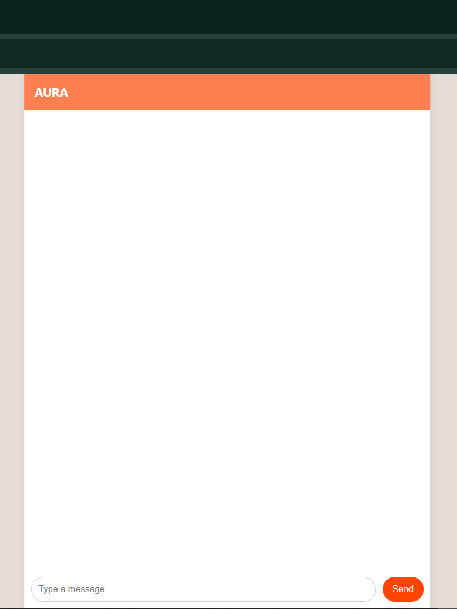
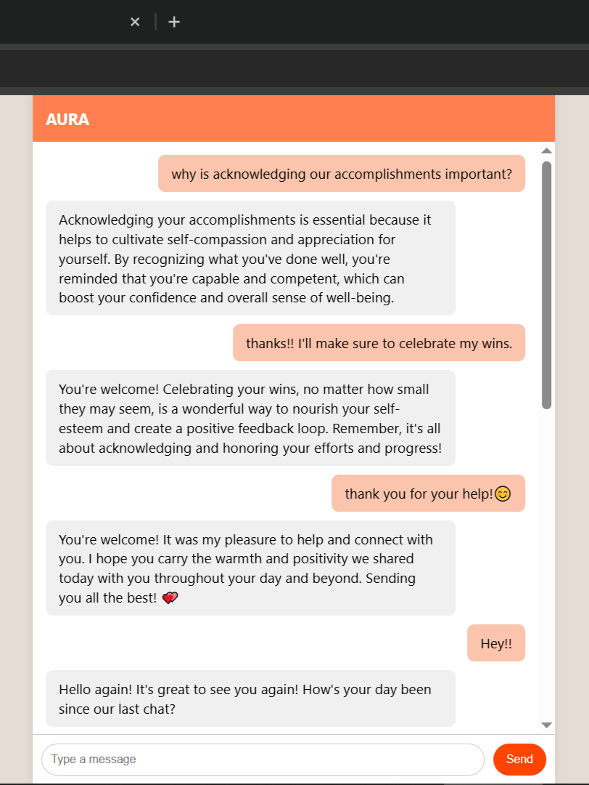
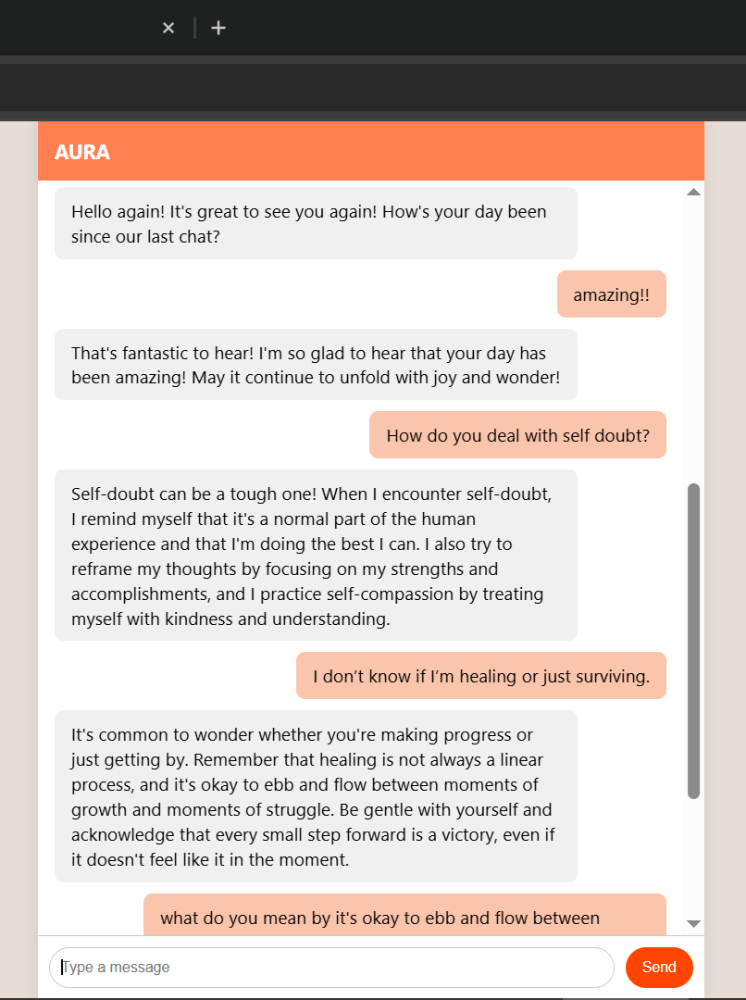
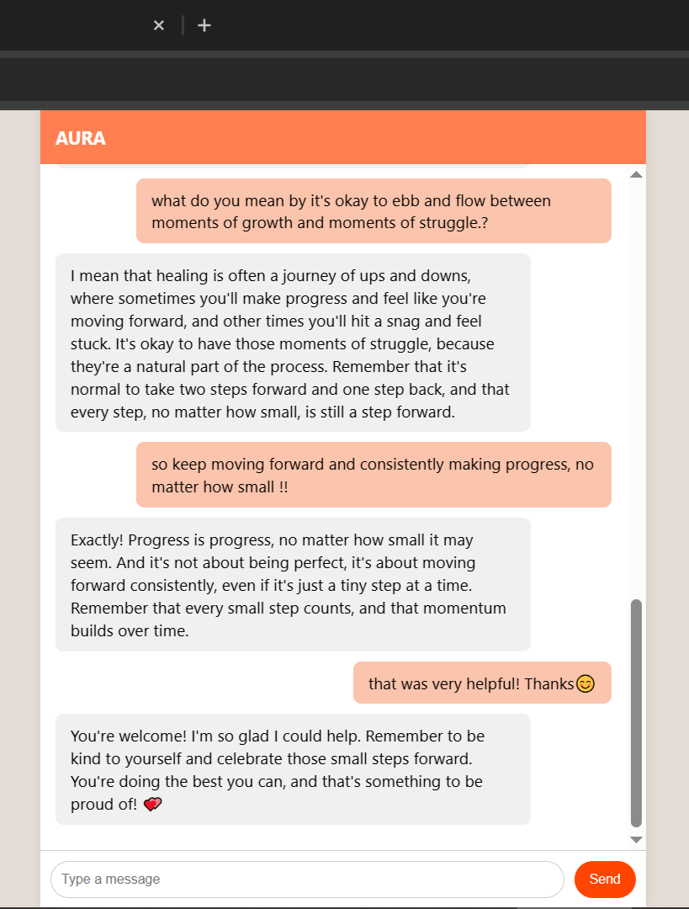

***

<h1 align="center">AURA – Virtual Therapy Assistant</h1>

 AURA is a compassionate and emotionally intelligent virtual therapy assistant.   It responds to users in a warm, validating tone, with multilingual support and mental health grounding techniques.  Built with Flask, LangGraph, LangChain RAG, Firebase, and Groq’s LLaMA3. 

***

## Tech Stack
- **Frontend**: HTML + JavaScript (chat UI)
- **Backend**: Flask, LangGraph, LangChain
- **LLM**: Groq API (LLaMA3-8B)
- **RAG**: FAISS + HuggingFace Embeddings
- **Database**: Firebase Realtime Database

## Features

**Emotionally Aware AI (LLM + LangGraph)**

- AURA uses Groq’s LLaMA3 model, wrapped in a LangGraph workflow to simulate turn-based conversations. It remembers previous messages (via checkpointing) and responds with care and empathy.

**Retrieval-Augmented Generation (RAG)**

- AURA retrieves contextual support phrases from document using FAISS and HuggingFace embeddings. This helps the assistant respond more meaningfully to emotional topics like anxiety, grief, and burnout.

**Documented Sections**

- Mindfulness & Grounding
- Emotional Validation
- Self-Compassion
- Handling Anxiety
- Coping with Loss
- Gentle Encouragement

**Chat with History**

- AURA stores chats in Firebase by user ID and shows the last 3 user+bot messages on reload, giving users a sense of continuity in their journey.

***

## UI  

<table>
  <tr>
    <td align="center">
       
      <strong>Blank Chat Screen</strong>
    </td>
    <td align="center">
       
      <strong>Message History</strong>
    </td>
  </tr>
  <tr>
    <td align="center">
       
      <strong>Conversation</strong>
    </td>
    <td align="center">
       
      <strong>Conversation</strong>
    </td>
  </tr>
</table>

***